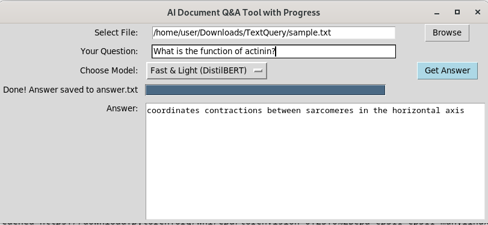

# 🧠 AI Agent Usage

<p align="center">
  
</p>

<p align="center"><em>🖼️ Example of the AI Document Q&A interface in action.</em></p>

---

## 1️⃣ Set Up Virtual Environment & Install Dependencies

```bash
# Create a virtual environment
python3 -m venv venv

# Activate the virtual environment
source venv/bin/activate

# Install required Python packages
pip install -r requirements.txt

# Install Tkinter (required for GUI, if needed)
sudo apt-get install python3-tk

# Run the AI agent
python ai_agent.py

