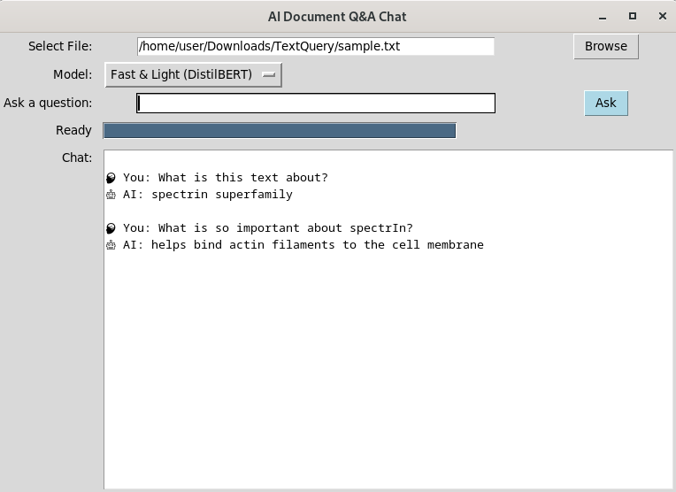

# 🧠 AI Agent Usage

<p align="center">
  
</p>

<p align="center"><em>🖼️ Example of the AI Document Q&A interface in action.</em></p>

---
## Requirements:
Minimum: 8 GB RAM
Recommended: 16 GB RAM

## 1️⃣ Set Up Virtual Environment & Install Dependencies


### Create a virtual environment
```bash
python3 -m venv venv
```
### Activate the virtual environment
```bash
source venv/bin/activate
```
### Install required Python packages
```bash
pip install -r requirements.txt
```
### Install if needed
```bash
pip install transformers
pip install torch --no-cache-dir
```

### Run the AI agent
```bash
python ai_agent.py
```


### Check MongoDB after usage
```bash
mongosh
```

### Switch to DB
```bash
use ai_qa_chat
```
###Check Queries
```bash
db.queries.find().pretty()
```

